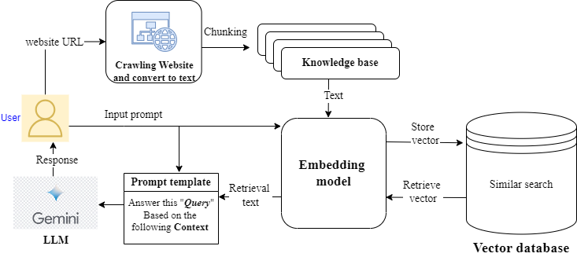

# Chat-any 
Chat with any website

## 1. Introduction

A Retrieval-Augmented Generation (RAG) system is a cutting-edge approach in natural language processing that combines retrieval-based and generation-based models to create highly accurate and contextually aware responses. In building such a system, leveraging the LlamaIndex framework facilitates efficient and dynamic interaction with vast amounts of web-based data. By employing the BAAI/bga-small-en model for embeddings, the system can generate high-quality vector representations of text, enhancing its ability to understand and retrieve relevant information from diverse web sources. The use of the Gemini-pro model as the large language model (LLM) ensures sophisticated and coherent generation of responses, enabling the RAG system to engage in meaningful and contextually appropriate dialogues. This amalgamation of advanced retrieval techniques and powerful generative capabilities allows for the development of a robust system capable of delivering precise and informative interactions with any website, making it a versatile tool for various applications, from customer support to research assistance.

## 2. Technical Overview

- System architecture
    
    
    

The process begins by using the **`llama_index.readers.web.SimpleWebPageReader`** to crawl a website and convert its content into text. This text is then split and embedded using the "BAAI/bga-small-en" embeddings model. When a user inputs a prompt, the LlamaIndex system performs a similarity search in the embedding space to find relevant information, which is then augmented to the original prompt. This augmented prompt is sent to the "Gemini-pro" language model (LLM), which generates a detailed and contextually appropriate response that is returned to the user. This system leverages advanced retrieval and generation techniques to provide accurate and relevant answers based on the content of the crawled website.

## 3. How to Install

## 4. Usage

# Miscs

## Demo video

9. demonstrate at least how-to-installation, and highlight all possible usages of your application.

## To Do

- [ ]  Streaming: query streaming with llama index
    - as_query_engine(stream=True, *similarity_top_k=4)*

## Limits

- Can only handle **english** language (Because I use [Huggingface: BAAI/bge-small-en](https://huggingface.co/BAAI/bge-small-en) as embedding model)